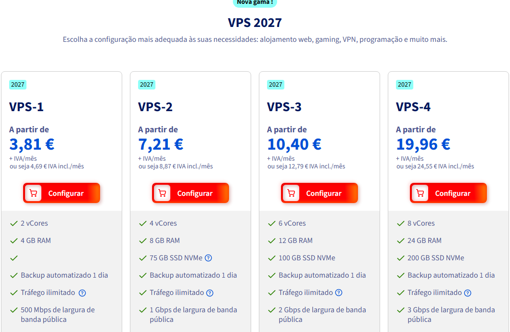
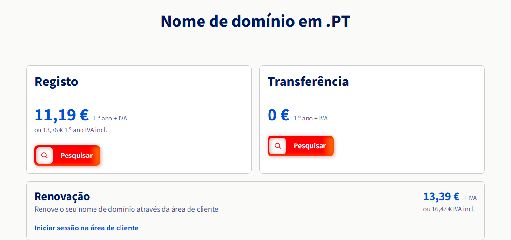

# Pedido de Aprovação de Despesa — Projeto CHICHORRO

## 1. Identificação

| Campo | Valor |
| --- | --- |
| Requerente | [A PREENCHER] |
| Número de aluno / mecanismo | [A PREENCHER] |
| Curso / Programa | [A PREENCHER] |
| Orientador(a) | [A PREENCHER] |
| Coorientador(a) | [A PREENCHER] |
| Unidade orgânica | Faculdade de Engenharia da Universidade do Porto (FEUP) |
| Data do pedido | 2026-07-10 |

## 2. Objetivo da despesa

O projeto **CHICHORRO** é uma aplicação web de apoio à decisão para avaliação de risco de
incêndio (modelo RI = f(POI, CTI, DPI, ESCI)), desenvolvida no âmbito de trabalho de
dissertação/investigação na FEUP. Atualmente a aplicação corre apenas numa máquina virtual de
staging na rede local, acessível externamente através de um túnel (Cloudflare Tunnel), sem
domínio próprio nem infraestrutura pública dedicada.

Para que o CHICHORRO possa ser:

1. **avaliado e demonstrado de forma estável** fora da rede local (defesa de dissertação,
   apresentações, avaliação por terceiros); e
2. **disponibilizado como serviço real**, com um endereço próprio e profissional, a
   entidades ou utilizadores que necessitem de consultar o risco de incêndio;

é necessário contratar (a) uma **máquina virtual privada (VPS)** pública na cloud para alojar o
backend, base de dados e frontend da aplicação, e (b) um **nome de domínio próprio**
(`chichorro.pt`) para acesso público estável, em vez de um subdomínio de terceiros.

Solicita-se que a FEUP suporte estes dois custos recorrentes, por não existir orçamento pessoal
ou institucional já alocado para infraestrutura de produção deste projeto.

## 3. Descrição técnica dos itens de custo

### 3.1 Servidor Privado Virtual (VPS)

Uma VPS é um servidor alojado na cloud, dedicado exclusivamente ao projeto, onde corre o
backend (FastAPI), a base de dados (PostgreSQL) e o frontend compilado da aplicação. É o
equivalente a "alugar" um computador remoto sempre ligado, com endereço IP público fixo,
necessário para que a aplicação esteja acessível a qualquer hora a partir de qualquer local.

O plano inclui de origem um backup automático diário do disco inteiro. Adiciona-se ainda a
opção de **Backup Snapshot**, que permite tirar manualmente uma imagem pontual do disco antes
de operações de risco (ex. atualização da base de dados), possibilitando reverter a VPS
inteira para esse instante em minutos — algo que um backup apenas de ficheiros não cobre.

### 3.2 Domínio `chichorro.pt`

Um nome de domínio é o endereço pelo qual a aplicação é acedida na internet (em vez de um IP
numérico ou de um subdomínio gratuito de terceiros). Um domínio `.pt` próprio reforça a
credibilidade e a identidade nacional do projeto, alinhado com o seu âmbito de proteção civil
em Portugal.

## 4. Tabela de custos

Tanto a VPS como o domínio são faturados **anualmente**: a VPS através de um plano com
**compromisso de 12 meses** (desconto de 15% face ao preço sem fidelização, pago de uma vez
por ano) e o domínio através do registo/renovação anual habitual. A tabela abaixo distingue os
dois itens antes de somar o total.

### 4.1 VPS — faturação anual (compromisso 12 meses)

| Item | Fornecedor | Plano | Custo mensal equivalente (IVA incl.) | Custo anual (pago de uma vez) |
| --- | --- | --- | --- | --- |
| VPS | OVHcloud | VPS-2 (gama 2027) — 4 vCores, 8 GB RAM, 75 GB NVMe SSD, tráfego ilimitado, anti-DDoS, backup diário incluído | €8,87/mês (equivalente) | €106,44/ano |
| Backup Snapshot (extra) | OVHcloud | Snapshot manual sob pedido, complementar ao backup diário incluído | €0,50/mês (equivalente) | €6,00/ano |

### 4.2 Domínio — faturação anual

| Item | Fornecedor | Plano | Custo 1.º ano | Custo anual (renovação, a partir do ano 2) |
| --- | --- | --- | --- | --- |
| Domínio `.pt` | OVHcloud | `chichorro.pt` | €13,76 (IVA incl.) | €16,47/ano (IVA incl.) |

### 4.3 Total combinado

| | Ano 1 | Ano 2 em diante |
| --- | --- | --- |
| VPS (compromisso 12 meses) | €106,44 | €106,44 |
| Backup Snapshot | €6,00 | €6,00 |
| Domínio (anual) | €13,76 | €16,47 |
| **Total** | **€126,20** | **€128,91/ano** |

> Valores de referência a preços públicos consultados em 2026-07-10 (ver provas de custo na
> secção 6). Plano escolhido com margem de crescimento face ao mínimo viável (VPS-1, 2 vCores/
> 4 GB) — ver justificação de sizing na secção 5.1. A OVHcloud oferece a VPS com três regimes
> de fidelização (sem compromisso, 6 meses ou 12 meses); optou-se pelo compromisso de **12
> meses**, que aplica um desconto de 15% face ao preço sem fidelização e é cobrado como um
> pagamento único anual de €106,44 (IVA incl.). O domínio é cobrado anualmente no registo e em
> cada renovação. A tabela usa o valor com IVA incluído para estimativa conservadora.

## 5. Alternativas consideradas e justificação da escolha

### 5.1 VPS

| Fornecedor / plano | Especificações | Custo mensal equivalente (IVA incl.) | Observação |
| --- | --- | --- | --- |
| OVHcloud VPS-1 (gama 2027) | 2 vCores, 4 GB RAM, 40 GB NVMe | €4,69 | Mínimo viável; sem margem para PostgreSQL + Redis + backend em simultâneo sob carga |
| **OVHcloud VPS-2 (gama 2027) — escolhido** | 4 vCores, 8 GB RAM, 75 GB NVMe | €8,87 (compromisso 12 meses) | Tráfego ilimitado, anti-DDoS e backup diário incluídos de origem; margem de crescimento face ao uso atual |
| Hetzner CX32 | 4 vCPU, 8 GB RAM, 80 GB SSD | €6,80 | Melhor preço/desempenho da UE, mas sem anti-DDoS/backup incluído por defeito |
| PTisp VPS Linux Core | 4 GB RAM, 4 vCPU, 75 GB | €8,00 | Fornecedor nacional, especificações equivalentes ao VPS-2 |

**Justificação:** o dimensionamento mínimo (VPS-1, 4 GB RAM) é apertado para correr
PostgreSQL + Redis + backend (cálculo simbólico numpy/sympy) no mesmo host. O plano
**VPS-2** (8 GB RAM) dá folga confortável e margem de crescimento caso a utilização deixe de
se limitar a poucos utilizadores convidados — sem exigir troca de fornecedor mais tarde.
Face a essa configuração, a OVHcloud mantém-se competitiva com o Hetzner CX32 (equivalente em
specs), já incluindo tráfego ilimitado, anti-DDoS e backup diário sem custo adicional. A
OVHcloud aplica desconto progressivo consoante o compromisso de permanência: sem compromisso
(preço base), 6 meses (-5%) ou 12 meses (-15%, valor usado nesta tabela e na secção 4.1).
Optou-se pelo compromisso de 12 meses por ser o mais económico a médio prazo e por o projeto
já ter um horizonte de utilização superior a um ano.

### 5.2 Domínio

| Registador | Custo 1.º ano | Renovação/ano | Observação |
| --- | --- | --- | --- |
| **OVHcloud (escolhido)** | €13,76 | €16,47 | Consolidação com a VPS na mesma conta/fatura; inclui Email Starter e DNSSEC |
| PTisp | ~€16,50 | ~€16,50 | Fornecedor nacional, custo muito semelhante |
| Dominios.pt | €32,90 (+IVA) | €32,90 (+IVA) | Registador nacional dedicado, mas mais caro |

**Justificação:** ao escolher o mesmo fornecedor (OVHcloud) para VPS e domínio, simplifica-se
a gestão administrativa (uma só conta, um só painel, uma só fatura), sem perda de
competitividade de preço face às alternativas nacionais.

## 6. Anexos — provas de custo

### Anexo 1 — Preços VPS OVHcloud (gama 2027)

Captura de ecrã da página oficial de preços de VPS da OVHcloud Portugal
(`www.ovhcloud.com/pt/vps/`), capturada em 2026-07-10, mostrando os quatro planos disponíveis
(VPS-1 a VPS-4) e respetivos preços com e sem IVA.

| Plano | vCores | RAM | Disco | Preço + IVA/mês | Preço IVA incl./mês |
| --- | --- | --- | --- | --- | --- |
| VPS-1 | 2 | 4 GB | 40 GB NVMe | 3,81 € | 4,69 € |
| **VPS-2 (escolhido)** | 4 | 8 GB | 75 GB NVMe | 7,21 € | 8,87 € |
| VPS-3 | 6 | 12 GB | 100 GB NVMe | 10,40 € | 12,79 € |
| VPS-4 | 8 | 24 GB | 200 GB NVMe | 19,96 € | 24,55 € |

Todos os planos incluem: backup automatizado diário, tráfego ilimitado, proteção anti-DDoS.

### Anexo 2 — Preço do domínio `chichorro.pt` OVHcloud

Captura de ecrã da página oficial de preços de domínios `.pt` da OVHcloud
(`www.ovhcloud.com/pt/domains/tld/pt/`), capturada em 2026-07-10, mostrando o custo de registo,
transferência e renovação.

| Item | Valor + IVA | Valor IVA incluído |
| --- | --- | --- |
| Registo (1.º ano) | 11,19 € | 13,76 € |
| Renovação (a partir do ano 2) | 13,39 € | 16,47 € |
| Transferência (1.º ano) | 0 € | 0 € |

Inclui: Email Starter e proteção DNS (DNSSEC), sem custo adicional.

## 7. Estimativa de custo total para aprovação

- **VPS:** €106,44/ano, faturado anualmente pela OVHcloud (compromisso de 12 meses, pago de
  uma vez)
- **Backup Snapshot (extra):** €6,00/ano
- **Domínio:** €13,76 no registo (ano 1), €16,47/ano em cada renovação (a partir do ano 2)
- **Total ano 1:** €126,20 (€106,44 de VPS + €6,00 de Snapshot + €13,76 de registo do domínio)
- **Total anos seguintes:** €128,91/ano (€106,44 de VPS + €6,00 de Snapshot + €16,47 de
  renovação do domínio)

Solicita-se aprovação da FEUP para suportar a anuidade da VPS (com o extra de Backup
Snapshot) e a anuidade do domínio, a debitar através do mecanismo de despesa aplicável a
projetos de dissertação/investigação da faculdade.
